# Nuke Template Manager - User Guide

## Configuration & Setup

The Template Manager uses a JSON configuration file to determine where to look for your .nk template files. It supports both single-user (local) and multi-user (studio) pipeline deployments.

### Individual Artist Setup

By default, the tool will automatically look for templates in ~/.nuke/templates. If you want to use custom directories:

Launch the Template Manager once to auto-generate the local configuration file.

Open the file located at: ~/.nuke/Template_Manager/templatemanager.json

Add your custom folders to the template_paths list:

```JSON
{
    "template_paths": [
        "C:/Users/Name/Documents/Nuke_Templates",
        "D:/Projects/Show_Name/Templates"
    ],
    "use_folder_categories": true
}
```

### Studio Pipeline Setup

For studios, you can centralize the configuration so all artists share the same template libraries without needing local config files.

1. Create a `templatemanager.json` file on your network drive (e.g., `Z:/pipeline/nuke/templatemanager.json`).
2. Inside that file, define your network template paths.
3. Set the following system environment variable on your artists' machines before launching Nuke:

   * **Variable Name:** `STUDIO_TEMPLATE_CONFIG`
   * **Variable Value:** `Z:/pipeline/nuke/templatemanager.json`

The tool will prioritize this environment variable over the local artist settings, ensuring everyone stays synced.

### Plugin Files on Disk

The plugin stores its data in `~/.nuke/Template_Manager/` (or wherever `STUDIO_TEMPLATE_CONFIG` points):

* `templatemanager.json` — main configuration file (template paths, global tag list, folder categories toggle).
* `template_metadata.json` — your manual per-template tag database.
* `auto_tags.json` — the auto-tag rules edited via the Rules Editor UI.
* `scanner_cache.json` — performance cache used to avoid re-parsing unchanged files. Safe to delete; it will be rebuilt on next launch.

## Features & Usage

Launch the tool inside Nuke by navigating to **Nuke > Template Manager > Browser** or by pressing `Ctrl+T`.

<p align="center">
  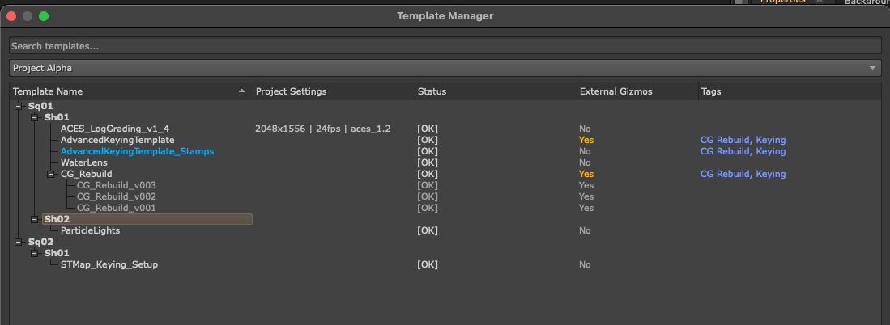
</p>

### 1. Folder-Based Organization (Dropdown Menu)

Templates are automatically sorted into groups based on their parent folder. By design, folders are intended to group your templates by Project or Show. For example, templates saved inside a folder named `Project_Alpha` will appear under a dedicated "Project Alpha" option in the dropdown menu, keeping show-specific setups neatly isolated. *(Note: The system is flexible, so studios or individuals can adapt this folder logic to fit whatever structure suits their specific pipeline.)*

When you launch the tool, it will also inspect the name of the script you currently have open in Nuke. If it can match the script to a known project or template group, that group is automatically selected from the dropdown menu and the matching template rows are pre-expanded and scrolled into view, so the most relevant entries are visible without any searching.
### 2. Health Status & Dependency Checking

The tool bypasses the standard Nuke API and performs a lightning-fast deep-text scan of your `.nk` files to ensure they won't crash your script. Each template displays a status:

* `[OK]`: All required nodes and plugins are installed on your machine.
* `[MISSING]`: The template contains third-party or OFX nodes that are missing from your current Nuke environment. Hover over the text to see a tooltip listing the exact plugins you need.
* `[ERROR]`: The `.nk` file is corrupted or failed to read.

<p align="center">
  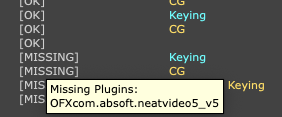
</p>

### 3. Project Settings Detection

Alongside the dependency check, the scanner inspects each template's `Root` block and reports its built-in project settings in the **Project Settings** column. Three values are shown when present, separated by ` | `:

* **Resolution** — e.g. `1920x1080`
* **Frame Rate** — e.g. `24fps`
* **Colour Management** — e.g. `aces_1.2` or `Nuke`

Templates that contain no `Root` block (project-agnostic snippets like gizmo setups, utility node clusters, or floating fragments) leave this column blank — there are no settings to import.

**Mismatch Dialog.** When you import a template whose project settings differ from your currently open Nuke script, the tool intercepts the paste and shows a Project Settings Mismatch dialog summarising every difference (FPS, resolution, colorspace). You get three choices:

* **Update Project** — applies the template's settings to your current Nuke script before pasting the nodes.
* **Just Import Nodes** — pastes the nodes without touching your project settings. Useful when you want the network but not its colour/resolution context.
* **Cancel** — abort the import.

<!-- TODO: add screenshot -->
<p align="center">
  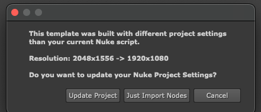
</p>

### 4. Smart Importing & Safety Warnings

* **Import:** Double-click any template, or select it and hit `Import Selected` to paste it directly into your Node Graph.
* **Safety Net:** If you try to import a template with a `[MISSING]` status, the tool will intercept the paste and display a warning dialog. You can choose to cancel, or force the import anyway if you are comfortable losing the missing nodes.

<p align="center">
  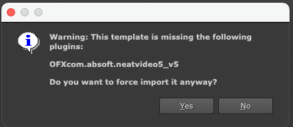
</p>

### 5. Read Node Placeholders

Templates often reference external footage that doesn't exist on the next artist's machine — broken Read paths after import are one of the most common template frustrations. To solve this, the tool offers an optional Placeholder workflow for any `Read` nodes present in the template.

When you import (or save) a template containing Read nodes, a **Convert Read Nodes** dialog appears listing every Read found, showing its node name and the basename of its current file path. Each entry is checked by default. You can:

* Leave entries checked to swap them with a red-tinted `NoOp` placeholder labelled `REPLACE WITH: <original_filename>`. Downstream connections are preserved automatically.
* Uncheck entries you want to keep as real Read nodes (useful when a Read points to a sharable asset like a LUT or a stock element).
* Cancel to abort the operation entirely.

On **import**, the conversion happens in a temporary copy of the template — your original `.nk` on disk is never modified. On **save**, the conversion happens in your live Nuke script, but is automatically undone after the save completes, so your working session is left untouched.

<!-- TODO: add screenshot -->
<p align="center">
  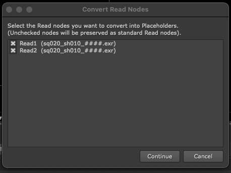
</p>

### 6. Saving Templates

Trigger a save by navigating to **Nuke > Template Manager > Save Template** or pressing `Ctrl+Shift+T`. The save action operates on whatever nodes you have selected in the DAG.

#### Fast-Track Save

Before opening the full save dialog, the tool checks whether the active Nuke script's name matches any existing template in your library. If it finds a match, you get a **Template Match Found** dialog with quick options tailored to the situation:

* **Version Up (v##)** — saves the selection as the next version above the highest one in the database. Used when your script's version is equal to or below the database's latest.
* **Save as v##** — appears when your script is on a *newer* version than anything in the database, letting you keep that version number rather than auto-incrementing.
* **Overwrite v##** — replace the latest version in place (destructive).
* **Open Full Menu** — bypass the fast-track and open the standard Save Template dialog instead.
* **Cancel** — abort.

The fast-track flow is designed for the common case of iterating on a template you've already saved: one click and you're versioned up, no project picker needed.

<!-- TODO: add screenshot -->
<p align="center">
  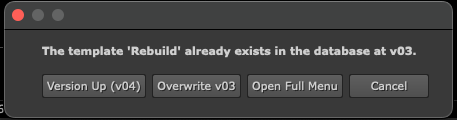
   &nbsp;&nbsp;&nbsp;&nbsp;
   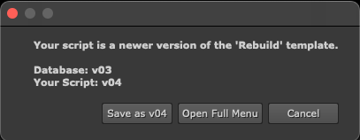
</p>

#### Full Save Dialog

If there's no fast-track match (or you click **Open Full Menu**), the standard Save Template dialog opens. From here you control four things:

* **Template Name** — the filename stem (no extension, no version suffix).
* **Project** — pick an existing project from the dropdown, choose **My Templates (Root)** to save at the top level, or select **[ + Create New Project ]** to type a brand-new project name. If the tool detected your current script's project, that entry will be pre-selected.
* **Subfolder** — an optional path within the project. The mini-tree on the left shows existing subfolders you can click to auto-fill, or you can type a new path (e.g. `Sq01/Sh010`) directly.
* **Auto-Version** — when enabled (the default), the next free `_v##` suffix is appended automatically. Disable to save without a version suffix; you'll be prompted to confirm if the target file already exists.

If your selection contains Read nodes, the Placeholder dialog (see [section 5](#5-read-node-placeholders)) will appear before the file is written.

<!-- TODO: add screenshot -->
<p align="center">
  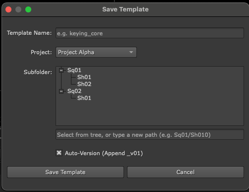
</p>

### 7. Advanced Tagging System

Keep your templates organized using custom, color-coded metadata tags. While folders handle the "where" (Projects), tags are designed to handle the "what" (Functions). Use tags to define what a template actually does, such as *keying*, *cleanup*, *despill*, or *relighting*. Tags are saved locally (or on the network) in `template_metadata.json`.

* **Inline Tagging:** Double-click the "Tags" column next to any template to type a new tag. Separate multiple tags with commas (e.g., `keying, edge_extend, fast`).
* **Procedural Colors:** Tags are automatically assigned a unique color based on the characters you type, keeping your UI visually consistent without manual styling.
* **Batch Tagging:** Select multiple templates, right-click, and choose `Batch Tag` to assign functional metadata to entire groups at once.

<p align="center">
  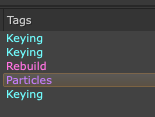
  &nbsp;&nbsp;&nbsp;&nbsp;
  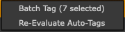
  &nbsp;&nbsp;&nbsp;&nbsp;
  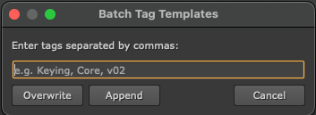
</p>

### 8. Auto-Tag Rules Editor

In addition to manual tags, the tool can apply tags automatically by analysing the node contents of each template. Open the editor via **Nuke > Template Manager > Edit Tagging Rules**.

Each rule pairs a **Tag Name** with a list of node class substrings and a match type:

* **OR** — apply the tag if *any* listed node appears in the template. Example: tag a script as `Keying` if it contains `primatte`, `keylight`, or `ibkgizmo`.
* **AND** — apply the tag only if *every* listed node appears. Example: tag a script as `Projection` only if it contains both `card` and `scanlinerender`.
* **How Many** — apply the tag when the number of matching nodes reaches a threshold. Example: tag a script as `CG Rebuild` if it contains six or more `shuffle` nodes.

Node names are matched case-insensitively, as substrings. Use the **+ Add New Rule** button to create more rules and the X button on each row to remove one. Click **Save** to write the new rule set to `auto_tags.json`.

**Re-Evaluate Auto-Tags.** Rule changes only affect future scans by default. To apply updated rules to templates already in the database, select the relevant rows in the main browser, right-click, and choose **Re-Evaluate Auto-Tags**. The selected templates are re-parsed and their tags replaced with the output of the current rule set. *(Note: this replaces all tags on those templates, including any manual ones — confirm before proceeding.)*

<!-- TODO: add screenshot -->
<p align="center">
  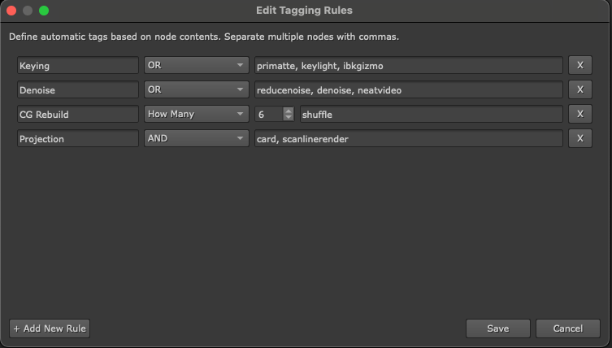
</p>

### 9. Search, Sorting & Filtering

The search bar supports dual-filtering for both names and tags:

* **Text Search:** Type normally to filter templates by their file name.
* **Tag Search:** Type `@` followed by your tag name (e.g., `@cleanup`) to filter exclusively by function. The search bar includes an autocomplete dropdown for all active tags in your database.
* **Clickable Sorting:** Click on any of the column headers (Template Name, Status, or Tags) to automatically sort the list A-Z or Z-A. By default, templates are sorted alphabetically by name upon launch.

<p align="center">
  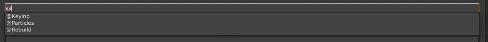
</p>

### 10. Proprietary Node Detection (Stamps)

If your studio utilizes proprietary tools like *Stamps* by Adrian Pueyo, the scanner will automatically detect their presence inside the script. Templates containing Stamps are highlighted in blue in the UI, allowing you to identify specialized scripts at a glance.

<p align="center">
  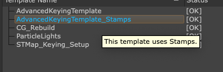
</p>