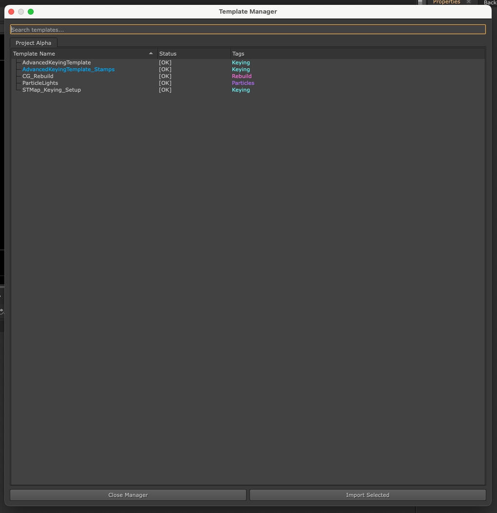
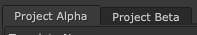
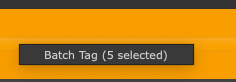
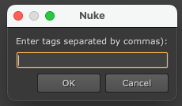

# Nuke Template Manager - User Guide

## Configuration & Setup

The Template Manager uses a JSON configuration file to determine where to look for your .nk template files. It supports both single-user (local) and multi-user (studio) pipeline deployments.

### Individual Artist Setup

By default, the tool will automatically look for templates in ~/.nuke/templates. If you want to use custom directories:

Launch the Template Manager once to auto-generate the local configuration file.

Open the file located at: ~/.nuke/Template_Manager/templatemanager.json

Add your custom folders to the template_paths list:

```JSON
{
    "template_paths": [
        "C:/Users/Name/Documents/Nuke_Templates",
        "D:/Projects/Show_Name/Templates"
    ],
    "use_folder_categories": true
}
```

### Studio Pipeline Setup

For studios, you can centralize the configuration so all artists share the same template libraries without needing local config files.

1. Create a `templatemanager.json` file on your network drive (e.g., `Z:/pipeline/nuke/templatemanager.json`).
2. Inside that file, define your network template paths.
3. Set the following system environment variable on your artists' machines before launching Nuke:

   * **Variable Name:** `STUDIO_TEMPLATE_CONFIG`
   * **Variable Value:** `Z:/pipeline/nuke/templatemanager.json`

The tool will prioritize this environment variable over the local artist settings, ensuring everyone stays synced.

## Features & Usage

Launch the tool inside Nuke by navigating to **Nuke > Template Manager > Start Template Manager** or by pressing `Ctrl+T`.

<p align="center">
  
</p>

### 1. Folder-Based Organization (Tabs)

Templates are automatically sorted into tabs based on their parent folder. By design, folders are intended to group your templates by Project or Show. For example, templates saved inside a folder named `Project_Alpha` will appear under a dedicated "Project Alpha" tab, keeping show-specific setups neatly isolated. *(Note: The system is flexible, so studios or individuals can adapt this folder logic to fit whatever structure suits their specific pipeline).*

<p align="center">
  
</p>

### 2. Health Status & Dependency Checking

The tool bypasses the standard Nuke API and performs a lightning-fast deep-text scan of your `.nk` files to ensure they won't crash your script. Each template displays a status:

* `[OK]`: All required nodes and plugins are installed on your machine.
* `[MISSING]`: The template contains third-party or OFX nodes that are missing from your current Nuke environment. Hover over the text to see a tooltip listing the exact plugins you need.
* `[ERROR]`: The `.nk` file is corrupted or failed to read.

<p align="center">
  
</p>

### 3. Smart Importing & Safety Warnings

* **Import:** Double-click any template, or select it and hit `Import Selected` to paste it directly into your Node Graph.
* **Safety Net:** If you try to import a template with a `[MISSING]` status, the tool will intercept the paste and display a warning dialog. You can choose to cancel, or force the import anyway if you are comfortable losing the missing nodes.

<p align="center">
  
</p>

### 4. Advanced Tagging System

Keep your templates organized using custom, color-coded metadata tags. While folders handle the "where" (Projects), tags are designed to handle the "what" (Functions). Use tags to define what a template actually does, such as *keying*, *cleanup*, *despill*, or *relighting*. Tags are saved locally (or on the network) in `template_metadata.json`.

* **Inline Tagging:** Double-click the "Tags" column next to any template to type a new tag. Separate multiple tags with commas (e.g., `keying, edge_extend, fast`).
* **Procedural Colors:** Tags are automatically assigned a unique color based on the characters you type, keeping your UI visually consistent without manual styling.
* **Batch Tagging:** Select multiple templates, right-click, and choose `Batch Tag` to assign functional metadata to entire groups at once.

<p align="center">
  
  &nbsp;&nbsp;&nbsp;&nbsp;
  
  &nbsp;&nbsp;&nbsp;&nbsp;
  
</p>

### 5. Search, Sorting & Filtering

The search bar supports dual-filtering for both names and tags:

* **Text Search:** Type normally to filter templates by their file name.
* **Tag Search:** Type `@` followed by your tag name (e.g., `@cleanup`) to filter exclusively by function. The search bar includes an autocomplete dropdown for all active tags in your database.
* **Clickable Sorting:** Click on any of the column headers (Template Name, Status, or Tags) to automatically sort the list A-Z or Z-A. By default, templates are sorted alphabetically by name upon launch.

<p align="center">
  
</p>

### 6. Proprietary Node Detection (Stamps)

If your studio utilizes proprietary tools like *Stamps* by Adrian Pueyo, the scanner will automatically detect their presence inside the script. Templates containing Stamps are highlighted in blue in the UI, allowing you to identify specialized scripts at a glance.

<p align="center">
  
</p>